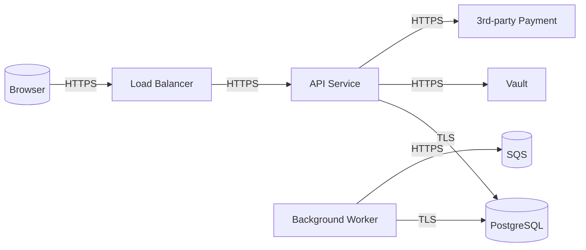

# Threat Modeling — End the Unsystematic Threat Hunt

> *"The attacker is already threat-modeling **you**. If you don't do it too,
> the gap between you is **their market advantage**."*

Threat modeling = keeping a **record** of what a system looks like, **how it
can be attacked**, and which control mitigates which threat. Not a week-long
formal exercise — a living document you can start in 90 minutes and attach to
a PR.

---

## 🎯 Why Do It?

| Problem | Threat modeling answer |
|---|---|
| "Is this new feature secure?" | Threat list + mitigation path for each threat |
| "Which control should we add?" | ROI list: high-threat / low-cost controls |
| "What should we look for in the pen-test?" | Threat model output = pentest scope |
| "The audit asks 'do you have a risk assessment'" | Threat model = the basis of the risk register |
| "A new engineer wants to learn system security" | It becomes an onboarding doc |

---

## 📐 Frameworks

### 1. STRIDE (Microsoft, 2002 — still the most widely used)

Evaluate each threat type one by one:

| Letter | Threat | Countermeasure category |
|---|---|---|
| **S**poofing | Impersonating someone's identity | Authentication |
| **T**ampering | Modifying data | Integrity (signing, hash) |
| **R**epudiation | Being able to say "I didn't do it" | Audit log, non-repudiation |
| **I**nformation Disclosure | Unauthorized data reading | Encryption, RBAC |
| **D**enial of Service | Blocking access | Rate limit, quota, scaling |
| **E**levation of Privilege | Escalating one's privilege | Least privilege, RBAC |

### 2. LINDDUN (Privacy-focused, for GDPR/KVKK compliance)

| Letter | Threat |
|---|---|
| **L**inkability | Two separate records get linked to the same person |
| **I**dentifiability | Data assumed anonymous is tied to a person |
| **N**on-repudiation | The person cannot deny (in a privacy context this is **bad**) |
| **D**etectability | It can be detected that a person is in the system |
| **D**isclosure | Information leakage |
| **U**nawareness | The user is unaware of data collection |
| **N**on-compliance | Legal non-compliance |

### 3. PASTA (Process for Attack Simulation and Threat Analysis)
7-stage, tied to business risk, heavier. Good for regulation/finance.

### 4. Attack Trees
Root = attacker goal, branches = ways to reach that goal.

```
Root: Müşteri kart numaralarını çal
├── App'e SQLi
│   ├── Input validation yok
│   └── Prepared statement yok
├── DB'ye direkt erişim
│   ├── DB internet'e açık
│   ├── Weak DB password
│   └── Compromised admin laptop
└── Backup'tan oku
    ├── Backup S3 public
    └── Backup unencrypted
```

> 🔑 **Practical advice:** For most teams **STRIDE** is enough. For
> privacy/regulation-heavy work, **STRIDE + LINDDUN**. Attack tree → can also
> be done separately for critical features.

---

## 📐 Lightweight Version: The 90-Minute Threat Model

When a new service design lands in a PR:

### 0–10 min: System diagram
Draw a **Data Flow Diagram (DFD)**. Mermaid is enough:



### 10–20 min: Draw the trust boundaries

```
[INTERNET]  ←→  [DMZ: LB, WAF]  ←→  [APP TIER]  ←→  [DATA TIER]
                                       ↓
                              [3RD PARTY: Payment]  (external trust boundary)
```

Trust boundary = "at this point data crosses from the **untrusted** side to the **trusted** side". A control is written for each boundary.

### 20–60 min: STRIDE for each component
| Component | S | T | R | I | D | E |
|---|---|---|---|---|---|---|
| LB | TLS termination, mTLS upstream | WAF rule | LB access log | TLS 1.3 | Rate limit | — |
| API | OAuth2/OIDC | Body schema validation | Audit log | Encryption-at-rest, RBAC | Rate limit + quota | RBAC, k8s RBAC |
| DB | DB user per service | FK constraint, transaction | DB audit (pgaudit) | TDE, column-level enc | Connection pool | Least-privilege role |
| External Payment | mTLS + signed JWT | Webhook signature verify | Webhook log | TLS only | Circuit breaker | API key in Vault |
| Background Worker | Service identity (SPIFFE) | Idempotency key | Job log | Same as API | Queue back-pressure | Worker SA |

### 60–80 min: Risk score + priority
For each threat:
- **Likelihood**: Low / Medium / High
- **Impact**: Low / Medium / High
- **Risk** = L × I (a simple 3x3 matrix is enough)

| Threat | L | I | Risk | Mitigation | Status |
|---|---|---|---|---|---|
| SQLi into the API | M | H | High | Prepared statements + input validation | ✅ Implemented |
| Vault token in pod env | M | H | High | File mount + tmpfs | ⚠️ TODO #234 |
| Webhook replay | L | M | Med | Nonce + timestamp + signature | ✅ Implemented |
| 3rd-party payment outage | M | M | Med | Circuit breaker + queue | ⚠️ TODO #235 |

### 80–90 min: Action items + owner
Every unmitigated threat → JIRA/Linear ticket + owner + due date.

---

## 📝 Threat Model Template

```markdown
# Threat Model: <SERVICE_NAME>
**Date:** 2026-05-04  
**Authors:** @halil, @security-team  
**Status:** Draft / Review / Accepted  

## 1. System Overview
<2-3 cümle: ne yapıyor, kim kullanıyor>

## 2. Data Flow Diagram
[Mermaid veya draw.io]

## 3. Assets (korunması gereken)
| Asset | Sensitivity | Notes |
|---|---|---|
| Müşteri PII | High | KVKK kapsamında |
| Kart numaraları | Critical | PCI DSS — saklanmıyor, tokenize |
| API keys | High | Vault'ta |

## 4. Trust Boundaries
- Internet ↔ DMZ (WAF, rate limit)
- DMZ ↔ App tier (mTLS)
- App ↔ DB (network policy + DB auth)
- App ↔ 3rd party (mTLS + signed JWT)

## 5. Threat Analysis (STRIDE)
[Komponent x STRIDE matrisi yukarıdaki gibi]

## 6. Risk Register
[Likelihood × Impact tablosu]

## 7. Mitigation Plan
| Tehdit | Mitigasyon | Owner | Due | Status |
|---|---|---|---|---|

## 8. Out of Scope
- DDoS at L3/L4 (CloudFlare gateway katmanında)
- Insider with full admin access (compensating: audit + vault)

## 9. Assumptions
- Cluster K8s 1.30+ ve PSS restricted enforce
- Tüm imajlar cosign ile imzalı
- mTLS service mesh ile her yerde

## 10. References
- [Kubernetes-Hardening.md](Kubernetes-Hardening.md)
- [Secrets-Management.md](Secrets-Management.md)
```

---

## 🎯 How Often?

| Trigger | Threat model |
|---|---|
| New service design (PR) | **Full STRIDE** (90 min) |
| New feature, existing service | **Mini delta** (30 min, only the changed part) |
| 3rd party integration | **Full** (new trust boundary) |
| Major architecture revision | **Full redo** |
| After a major incident | **Together with the postmortem** (gap analysis) |
| Annually | **Refresh every service's TM** |

---

## 🧰 Tools

| Tool | Type | Cost |
|---|---|---|
| **OWASP Threat Dragon** | Open source, web/desktop | Free |
| **Microsoft Threat Modeling Tool** | Windows desktop | Free |
| **IriusRisk** | Enterprise | Commercial |
| **ThreatModeler** | Enterprise | Commercial |
| **PyTM** | Python code-as-threat-model | Free |
| **Mermaid + Markdown + GitHub** | Plain text | Free |

> 🔑 **Practical advice:** Markdown + Mermaid + GitHub repo. Don't defer threat
> modeling in order to learn a tool. A dev friend who knows Mermaid is enough
> for you.

### PyTM example (threat model as code)
```python
from pytm import TM, Server, Datastore, Dataflow, Boundary, Actor

tm = TM("API Service")

internet = Boundary("Internet")
internal = Boundary("Internal Network")

user = Actor("User")
user.inBoundary = internet

api = Server("API Service")
api.inBoundary = internal

db = Datastore("PostgreSQL")
db.inBoundary = internal

req = Dataflow(user, api, "API Request")
req.protocol = "HTTPS"
req.dstPort = 443

query = Dataflow(api, db, "DB Query")
query.protocol = "PostgreSQL"
query.dstPort = 5432
query.isEncrypted = True

tm.process()  # generates the threat report
```

---

## 🚨 Quick Threat Checklist (For Code Review)

Ask in 60 seconds during PR review:

### Authentication
- [ ] If a new endpoint was opened, is there an auth check?
- [ ] Is the OAuth scope/audience correct?
- [ ] Does token revocation work?

### Authorization
- [ ] Is RBAC defined for the new resource?
- [ ] Is cross-tenant access blocked?
- [ ] Are admin endpoints on separate RBAC?

### Input
- [ ] Is there schema validation (JSON Schema, Zod, Pydantic)?
- [ ] Is SQL parameterized (prepared statement)?
- [ ] File upload size + content-type check?
- [ ] XSS escape (is the template engine correct)?

### Output
- [ ] Is sensitive data kept out of the logs (token, password, PII)?
- [ ] Does the error message avoid returning a stack trace in prod?
- [ ] Is CORS correctly restricted?

### Crypto
- [ ] TLS 1.2+ enforced?
- [ ] No hardcoded key/secret?
- [ ] Hash: bcrypt/scrypt/argon2 (not MD5/SHA1)?

### Storage
- [ ] Encryption at rest (DB, S3)?
- [ ] Is there a PII deletion procedure (KVKK/GDPR right-to-erasure)?
- [ ] Backup encrypted?

### Network
- [ ] Is the new service defined in a NetworkPolicy?
- [ ] Should it have been public or internal?
- [ ] Is egress to the internet needed, and why?

---

## 📊 Anti-Pattern Table

| Anti-pattern | Why it's bad | Right way |
|---|---|---|
| "Threat model is the security team's job" | The team writes code, you're the architect | TM authoring belongs to the developer, security does the review |
| One-off document, dusty on the shelf | Architecture changed, the TM is stale | Living document, update on every major change |
| 100-page formal STRIDE for every service | Excessive burden → nobody does it | Lightweight version 90 min, depth for critical services |
| There's a risk list but no mitigation | "Visible" security | Every threat → owner + due date |
| Making up a formula for the threat | Pseudo-scores are not credible | Likelihood × Impact 3x3 is enough |
| Leaving external services out of scope | The supply chain is the weakest link | 3rd party trust boundary, write mitigation |
| Doing the TM while already using the product | Architecture decisions can't be undone | Design phase, before code is written |
| No threat catalog, every TM from scratch | Recurring threats get missed | Internal threat catalog, record common patterns |

---

## 🇹🇷 Turkey-Specific: KVKK + LINDDUN

Under KVKK, threat modeling specifically requires the LINDDUN categories:

| LINDDUN threat | KVKK violation |
|---|---|
| **Linkability** | Pseudonymized data → identifying a person (Article 28) |
| **Identifiability** | Aggregated data but re-identification (Article 4) |
| **Disclosure** | Unauthorized data sharing (Articles 8-9) |
| **Non-compliance** | DPIA not performed (Article 28) |

> 📌 **Practical:** If a new feature processes personal data, do both STRIDE +
> LINDDUN together. See [`19-Compliance/KVKK-Practical.md`](../19-Compliance/KVKK-Practical.md) (Phase 4).

---

## 📋 Threat Modeling Checklist

```
[ ] Her yeni servis için TM doc var (PR template'inde zorunlu alan)
[ ] TM Git'te, kodla aynı repo'da (yaşar)
[ ] Mermaid DFD + trust boundary'ler net
[ ] STRIDE her komponent için tablolu
[ ] Risk register: L × I matris
[ ] Mitigation: owner + due date + status
[ ] Out-of-scope açıkça belirtilmiş
[ ] Assumptions yazılı (security context, mTLS, vb.)
[ ] PR review'da TM güncellemesi gerektiren değişiklik kontrol ediliyor
[ ] Yıllık tüm critical servis TM'leri refresh
[ ] Security ekibi review imzalı (sign-off)
[ ] Tehdit catalog: tekrar eden pattern'lerin internal kütüphanesi
[ ] PII varsa LINDDUN da yapıldı
```

---

## 📚 References

- **Threat Modeling: Designing for Security** — Adam Shostack (book, the best starting point)
- **OWASP Threat Modeling Cheat Sheet** — cheatsheetseries.owasp.org
- **Microsoft STRIDE** — learn.microsoft.com
- **LINDDUN** — linddun.org
- **Threat Dragon** — owasp.org/www-project-threat-dragon
- **PyTM** — github.com/izar/pytm
- [`Kubernetes-Hardening.md`](Kubernetes-Hardening.md) — control catalog
- [`19-Compliance/KVKK-Practical.md`](../19-Compliance/KVKK-Practical.md) (Phase 4)

---

> *"Threat modeling isn't 'being paranoid' — it's **disciplined paranoia**.
> You systematically know which threat you overlooked; and with the same
> system you also know what isn't worth worrying about."*

---

> 🎓 **Learning Path:** This document is used as a "Read first" resource in the [`F2`](../22-Learning-Path/block-f-judgment/F2-tehdit-uyum.md) module.
