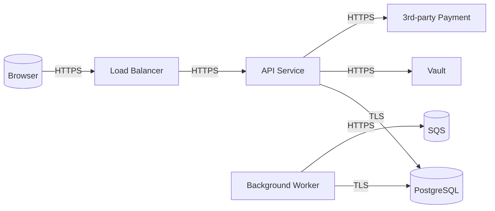

# Threat Modeling — Sistemsiz Tehdit Avı Bitsin

> *"Saldırgan zaten **size** bir threat model yapıyor. Siz yapmazsanız
> aradaki fark, **onun pazar avantajıdır**."*

Threat modeling = bir sistemin neye benzediğini, **nasıl saldırılabileceğini**,
ve hangi kontrolün hangi tehdidi azalttığını **kayıtlı** tutmaktır. Bir
hafta süren formal egzersiz değil — 90 dakikada başlanıp PR'a iliştirilen
yaşayan bir doküman.

---

## 🎯 Niye Yapılır?

| Sorun | Threat modeling cevabı |
|---|---|
| "Bu yeni feature güvenli mi?" | Tehdit listesi + her tehdidin azaltılma yolu |
| "Hangi kontrolü ekleyelim?" | ROI listesi: yüksek-tehdit / düşük-maliyet kontroller |
| "Pen-test'te ne aratalım?" | Threat model çıktısı = pentest scope |
| "Audit'te 'risk değerlendirmesi var mı' soruluyor" | Threat model = risk register'ın temeli |
| "Yeni mühendis sistem güvenliğini öğrenmek istiyor" | Onboarding doc'u olur |

---

## 📐 Çerçeveler

### 1. STRIDE (Microsoft, 2002 — hâlâ en çok kullanılan)

Her threat type'ı tek tek değerlendir:

| Harf | Tehdit | Karşı kontrol kategorisi |
|---|---|---|
| **S**poofing | Birinin kimliğini taklit etme | Authentication |
| **T**ampering | Veriyi değiştirme | Integrity (signing, hash) |
| **R**epudiation | "Ben yapmadım" diyebilme | Audit log, non-repudiation |
| **I**nformation Disclosure | Yetkisiz veri okuma | Encryption, RBAC |
| **D**enial of Service | Erişimi engelleme | Rate limit, quota, scaling |
| **E**levation of Privilege | Yetkisini büyütme | Least privilege, RBAC |

### 2. LINDDUN (Privacy-focused, GDPR/KVKK uyumu için)

| Harf | Tehdit |
|---|---|
| **L**inkability | Iki ayrı kayıt aynı kişide bağlanır |
| **I**dentifiability | Anonim sanılan veri kişiye bağlanır |
| **N**on-repudiation | Kişi reddedemez (privacy bağlamında **kötü**) |
| **D**etectability | Kişinin sistemde olduğu tespit edilebilir |
| **D**isclosure | Bilgi sızıntısı |
| **U**nawareness | Kullanıcı veri toplamadan habersiz |
| **N**on-compliance | Yasal uyumsuzluk |

### 3. PASTA (Process for Attack Simulation and Threat Analysis)
7-aşamalı, business risk'e bağlı, daha ağır. Düzenleme/finans için iyi.

### 4. Attack Trees
Kök = saldırgan hedefi, dallar = bu hedefe ulaşma yolları.

```
Root: Müşteri kart numaralarını çal
├── App'e SQLi
│   ├── Input validation yok
│   └── Prepared statement yok
├── DB'ye direkt erişim
│   ├── DB internet'e açık
│   ├── Weak DB password
│   └── Compromised admin laptop
└── Backup'tan oku
    ├── Backup S3 public
    └── Backup unencrypted
```

> 🔑 **Pratik öneri:** Çoğu ekip için **STRIDE** yeterli. Privacy/regülasyon
> ağırlıklı işlerde **STRIDE + LINDDUN**. Attack tree → kritik feature'lar
> için ayrıca yapılabilir.

---

## 📐 Hafif Sürüm: 90 Dakikalık Threat Model

Yeni servis tasarımı PR'a düştüğünde:

### 0–10 dk: Sistem diagramı
**Data Flow Diagram (DFD)** çiz. Mermaid yeter:



### 10–20 dk: Trust boundary'leri çiz

```
[INTERNET]  ←→  [DMZ: LB, WAF]  ←→  [APP TIER]  ←→  [DATA TIER]
                                       ↓
                              [3RD PARTY: Payment]  (external trust boundary)
```

Trust boundary = "bu noktada veri **güvenilmeyen** taraftan **güvenilen** tarafa geçiyor". Her boundary için kontrol yazılır.

### 20–60 dk: STRIDE her kompozite
| Komponent | S | T | R | I | D | E |
|---|---|---|---|---|---|---|
| LB | TLS termination, mTLS upstream | WAF rule | LB access log | TLS 1.3 | Rate limit | — |
| API | OAuth2/OIDC | Body schema validation | Audit log | Encryption-at-rest, RBAC | Rate limit + quota | RBAC, k8s RBAC |
| DB | DB user per service | FK constraint, transaction | DB audit (pgaudit) | TDE, column-level enc | Connection pool | Least-privilege role |
| External Payment | mTLS + signed JWT | Webhook signature verify | Webhook log | TLS only | Circuit breaker | API key in Vault |
| Background Worker | Service identity (SPIFFE) | Idempotency key | Job log | Same as API | Queue back-pressure | Worker SA |

### 60–80 dk: Risk skor + öncelik
Her tehdidi:
- **Likelihood**: Düşük / Orta / Yüksek
- **Impact**: Düşük / Orta / Yüksek
- **Risk** = L × I (basit 3x3 matris yeterli)

| Tehdit | L | I | Risk | Mitigasyon | Status |
|---|---|---|---|---|---|
| API'ye SQLi | M | H | High | Prepared statements + input validation | ✅ Implemented |
| Vault token'ı pod env'de | M | H | High | File mount + tmpfs | ⚠️ TODO #234 |
| Webhook replay | L | M | Med | Nonce + timestamp + signature | ✅ Implemented |
| 3rd-party payment outage | M | M | Med | Circuit breaker + queue | ⚠️ TODO #235 |

### 80–90 dk: Action items + owner
Her unmitigated tehdit → JIRA/Linear ticket + sahip + due date.

---

## 📝 Threat Model Şablonu

```markdown
# Threat Model: <SERVICE_NAME>
**Date:** 2026-05-04  
**Authors:** @halil, @security-team  
**Status:** Draft / Review / Accepted  

## 1. System Overview
<2-3 cümle: ne yapıyor, kim kullanıyor>

## 2. Data Flow Diagram
[Mermaid veya draw.io]

## 3. Assets (korunması gereken)
| Asset | Sensitivity | Notes |
|---|---|---|
| Müşteri PII | High | KVKK kapsamında |
| Kart numaraları | Critical | PCI DSS — saklanmıyor, tokenize |
| API keys | High | Vault'ta |

## 4. Trust Boundaries
- Internet ↔ DMZ (WAF, rate limit)
- DMZ ↔ App tier (mTLS)
- App ↔ DB (network policy + DB auth)
- App ↔ 3rd party (mTLS + signed JWT)

## 5. Threat Analysis (STRIDE)
[Komponent x STRIDE matrisi yukarıdaki gibi]

## 6. Risk Register
[Likelihood × Impact tablosu]

## 7. Mitigation Plan
| Tehdit | Mitigasyon | Owner | Due | Status |
|---|---|---|---|---|

## 8. Out of Scope
- DDoS at L3/L4 (CloudFlare gateway katmanında)
- Insider with full admin access (compensating: audit + vault)

## 9. Assumptions
- Cluster K8s 1.30+ ve PSS restricted enforce
- Tüm imajlar cosign ile imzalı
- mTLS service mesh ile her yerde

## 10. References
- [Kubernetes-Hardening.md](Kubernetes-Hardening.md)
- [Secrets-Management.md](Secrets-Management.md)
```

---

## 🎯 Hangi Sıklıkta?

| Tetikleyici | Threat model |
|---|---|
| Yeni servis tasarımı (PR) | **Tam STRIDE** (90 dk) |
| Yeni feature, mevcut servis | **Mini delta** (30 dk, sadece değişen kısım) |
| 3rd party entegrasyonu | **Tam** (yeni trust boundary) |
| Mimarinin büyük revizyonu | **Tam yeniden** |
| Major incident sonrası | **Postmortem ile birlikte** (gap analizi) |
| Yıllık | **Her servisin TM'i refresh** |

---

## 🧰 Araçlar

| Araç | Tip | Maliyet |
|---|---|---|
| **OWASP Threat Dragon** | Açık kaynak, web/desktop | Free |
| **Microsoft Threat Modeling Tool** | Windows desktop | Free |
| **IriusRisk** | Enterprise | Ticari |
| **ThreatModeler** | Enterprise | Ticari |
| **PyTM** | Python kod-as-threat-model | Free |
| **Mermaid + Markdown + GitHub** | Plain text | Free |

> 🔑 **Pratik öneri:** Markdown + Mermaid + GitHub repo. Tool öğrenmek için
> threat modeling ertelenmesin. Senin için Mermaid bilen bir dev arkadaş
> kâfi.

### PyTM örneği (kod ile threat model)
```python
from pytm import TM, Server, Datastore, Dataflow, Boundary, Actor

tm = TM("API Service")

internet = Boundary("Internet")
internal = Boundary("Internal Network")

user = Actor("User")
user.inBoundary = internet

api = Server("API Service")
api.inBoundary = internal

db = Datastore("PostgreSQL")
db.inBoundary = internal

req = Dataflow(user, api, "API Request")
req.protocol = "HTTPS"
req.dstPort = 443

query = Dataflow(api, db, "DB Query")
query.protocol = "PostgreSQL"
query.dstPort = 5432
query.isEncrypted = True

tm.process()  # threat raporu oluşturur
```

---

## 🚨 Hızlı Tehdit Kontrol Listesi (Kod Review İçin)

PR review'da 60 saniyede sor:

### Authentication
- [ ] Yeni endpoint açıldıysa auth check var mı?
- [ ] OAuth scope/audience doğru?
- [ ] Token revocation çalışıyor mu?

### Authorization
- [ ] Yeni resource için RBAC tanımlı mı?
- [ ] Cross-tenant erişim engellendi mi?
- [ ] Admin endpoint'leri ayrı RBAC'ta mı?

### Input
- [ ] Schema validation var mı (JSON Schema, Zod, Pydantic)?
- [ ] SQL parametreli mi (prepared statement)?
- [ ] File upload size + content-type kontrolü?
- [ ] XSS escape (template engine doğru mu)?

### Output
- [ ] Sensitive data log'a düşmüyor mu (token, password, PII)?
- [ ] Error message stack trace döndürmüyor mu prod'da?
- [ ] CORS doğru kısıtlı mı?

### Crypto
- [ ] TLS 1.2+ enforce?
- [ ] Hardcoded key/secret yok?
- [ ] Hash: bcrypt/scrypt/argon2 (MD5/SHA1 değil)?

### Storage
- [ ] Encryption at rest (DB, S3)?
- [ ] PII silme prosedürü var mı (KVKK/GDPR right-to-erasure)?
- [ ] Backup encrypted?

### Network
- [ ] Yeni servis NetworkPolicy'de tanımlı mı?
- [ ] Public mi olmalıydı yoksa internal mi?
- [ ] Internet'e egress gerekiyor mu, niye?

---

## 📊 Anti-Pattern Tablosu

| Anti-pattern | Niye kötü | Doğru |
|---|---|---|
| "Threat model security ekibinin işi" | Ekip kod yazıyor, sen mimar | TM authoring developer'ında, security review yapıyor |
| Tek seferlik dokuman, raftan tozlu | Mimari değişti, TM eski | Yaşayan dokuman, her major change'de update |
| 100 sayfa formal STRIDE her servise | Aşırı yük → kimse yapmaz | Hafif sürüm 90 dk, derinlik kritik servislerde |
| Risk listesi var, mitigasyon yok | "Görünür" güvenlik | Her tehdit → owner + due date |
| Tehditi formula uydurma | Pseudo-skor itibarsız | Likelihood × Impact 3x3 yeter |
| External services'i scope dışı bırakma | Tedarik zinciri en zayıf halka | 3rd party trust boundary, mitigation yaz |
| Ürünü kullanırken TM yapmak | Mimari kararlar geri alınamaz | Design phase, kod yazılmadan önce |
| Threat catalog yok, her TM sıfırdan | Tekrar eden tehditler atlanır | Internal threat catalog, common pattern'leri kayıt |

---

## 🇹🇷 Türkçe Özel: KVKK + LINDDUN

KVKK kapsamında threat modeling LINDDUN kategorilerini özellikle gerektirir:

| LINDDUN tehdit | KVKK ihlal |
|---|---|
| **Linkability** | Pseudonymized data → kişi tespit (Madde 28) |
| **Identifiability** | Aggregated data fakat re-identification (Madde 4) |
| **Disclosure** | İzinsiz veri paylaşımı (Madde 8-9) |
| **Non-compliance** | DPIA yapılmamış (Madde 28) |

> 📌 **Pratik:** Yeni feature kişisel veri işliyorsa STRIDE + LINDDUN
> ikisini birden yap. Bkz [`19-Compliance/KVKK-Practical.md`](../19-Compliance/KVKK-Practical.md) (Faz 4).

---

## 📋 Threat Modeling Checklist

```
[ ] Her yeni servis için TM doc var (PR template'inde zorunlu alan)
[ ] TM Git'te, kodla aynı repo'da (yaşar)
[ ] Mermaid DFD + trust boundary'ler net
[ ] STRIDE her komponent için tablolu
[ ] Risk register: L × I matris
[ ] Mitigation: owner + due date + status
[ ] Out-of-scope açıkça belirtilmiş
[ ] Assumptions yazılı (security context, mTLS, vb.)
[ ] PR review'da TM güncellemesi gerektiren değişiklik kontrol ediliyor
[ ] Yıllık tüm critical servis TM'leri refresh
[ ] Security ekibi review imzalı (sign-off)
[ ] Tehdit catalog: tekrar eden pattern'lerin internal kütüphanesi
[ ] PII varsa LINDDUN da yapıldı
```

---

## 📚 Referanslar

- **Threat Modeling: Designing for Security** — Adam Shostack (kitap, en iyi başlangıç)
- **OWASP Threat Modeling Cheat Sheet** — cheatsheetseries.owasp.org
- **Microsoft STRIDE** — learn.microsoft.com
- **LINDDUN** — linddun.org
- **Threat Dragon** — owasp.org/www-project-threat-dragon
- **PyTM** — github.com/izar/pytm
- [`Kubernetes-Hardening.md`](Kubernetes-Hardening.md) — kontrol katalog
- [`19-Compliance/KVKK-Practical.md`](../19-Compliance/KVKK-Practical.md) (Faz 4)

---

> *"Threat modeling 'paranoid olmak' değil — **disiplinli paranoyaktır**.
> Hangi tehdidi gözden kaçırdığını sistematik bilirsin; nelerin endişe
> edilmeye değmediğini de aynı sistemle bilirsin."*
