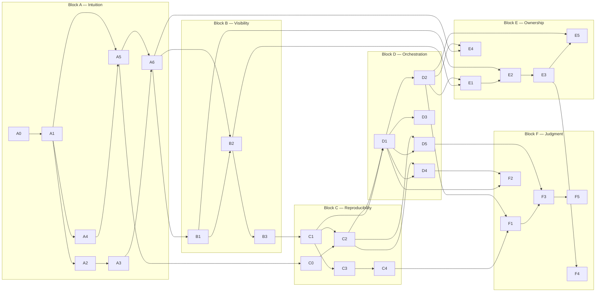

# 🗺️ Curriculum — Blocks, Dependencies, Transition Signals

> *"Order is built around dependency, not technology. Every step's rationale: it's required to understand the next one."*

This page is the skeleton of the path: which module belongs to which block, what it
counts as a prerequisite, when you move from one block to the next. **Block boundaries
and the order between blocks cannot be changed.** Splitting modules *within* a block
is fine.

The level axis isn't the number of tools — it's the **radius of responsibility:**

| | Definition |
|---|---|
| **L0** | Does defined work on a defined system |
| **L1** | Owns a system, takes the calls for it |
| **L2** | Decides which system should exist, can say "no" |

---

## 📋 Module table

| ID | Module | Block | Duration | Prerequisite |
|---|---|---|---|---|
| A0 | Before you start: environment, terminal, how the path works | A · L0 | ~6h | — |
| A1 | Linux fundamentals: process, filesystem, permissions, user/group | A · L0 | ~16h | A0 |
| A2 | Networking I: TCP/IP, ports, routing | A · L0 | ~14h | A1 |
| A3 | Networking II: DNS → HTTP → TLS/certificates | A · L0 | ~16h | A2 |
| A4 | Git fundamentals: commit, branch, merge, rebase, conflict | A · L0 | ~12h | A1 |
| A5 | Bash — just enough shell to get work done | A · L0 | ~12h | A1, A4 |
| A6 | Stand up an application **by hand** (NO containers) | A · L0 | ~27h | A1, A2, A3, A4, A5 |
| B1 | Reading logs: journalctl, structured logging | B · L0 | ~12h | A6 |
| B2 | Metrics: Prometheus fundamentals, cardinality | B · L0 | ~12h | A6, B1 |
| B3 | **First broken lab** — finding the fault on a broken VM | B · L0 | ~12h | B1, B2 |
| C0 | Python for ops — just enough to write automation scripts | C · L1 | ~30h | A5 |
| C1 | Containers: image, layer, multi-stage, compose | C · L1 | ~14h | A6, B3 |
| C2 | CI: test → build → artifact → registry | C · L1 | ~16h | A4, C0, C1 |
| C3 | Terraform — automate A6 | C · L1 | ~16h | A6, C1 |
| C4 | Cloud fundamentals + **budget alerts** | C · L1 | ~12h | C3 |
| D1 | K8s fundamentals: Pod/Deployment/Service/Ingress — **RBAC + NetworkPolicy from day one** | D · L1 | ~28h | C1, C2 |
| D2 | K8s in production: request/limit, probes, PDB, HPA | D · L1 | ~16h | D1 |
| D3 | Secret management | D · L1 | ~12h | D1 |
| D4 | Supply chain: scanning + signing — **a continuation of the C2 pipeline** | D · L1 | ~14h | C2, D1 |
| D5 | GitOps (ArgoCD) — single application | D · L1 | ~14h | D1, C2 |
| E1 | SLI / SLO / error budget | E · L1 | ~12h | B2, D2 |
| E2 | Alerting + on-call discipline | E · L1 | ~12h | E1, B1 |
| E3 | Incident response + blameless postmortem | E · L1 | ~14h | E2 |
| E4 | Databases in production — especially **restore** | E · L1 | ~14h | A6, D2 |
| E5 | Advanced broken lab / chaos | E · L1 | ~12h | E3, D2 |
| F1 | Cost and trade-offs (FinOps) | F · L2 | ~10h | C4, D2 |
| F2 | Threat modeling + compliance (KVKK / GDPR / SOC 2) | F · L2 | ~12h | D1, D4 |
| F3 | Platform, IDP, Team Topologies | F · L2 | ~10h | D5, F1 |
| F4 | Writing: ADR, RFC, postmortem | F · L2 | ~10h | E3 |
| F5 | Stakeholder management, saying "no", vendors | F · L2 | ~6h | F3 |

**Total:** 30 modules · ~423 hours · + 3 capstones (~60 hours) = **~483 hours**.
Block totals: A 103 · B 36 · C 88 · D 84 · E 64 · F 48 · Capstone 60.

Gate projects: **Capstone 1** (end of Block C), **Capstone 2** (end of Block D),
**Capstone 3** (end of Block E) → [`capstones/`](capstones/CAP1-blok-c-sonu.md).

---

## 🔗 Dependency graph (DAG — no cycles)

**Verification:** Every module's every prerequisite comes **before** it; there are no
cycles; no module treats a later block as a prerequisite; A0 has no prerequisites (the
single entry point — anyone starting from zero enters here).

---

## 🚦 Transition signals — not a calendar

Block transitions are tied to these questions, not to a duration. The acceptance
criteria make these signals concrete:

| Transition | Signal |
|---|---|
| A → B | Can you narrow down why a service won't start, using three commands, without checking the docs? |
| B → C | Did you **prove** a fault with logs and metrics, rather than guess it? |
| C → D | Can you rebuild your system from scratch without touching anything by hand? |
| D → E | Did something you built break because of your own mistake, and did you bring it back? |
| E → F | Did you say "no" to something and defend your reasoning in writing? |

These signals become concrete at the end of each block through a **stage exam** —
every question traces back to a module's acceptance criterion; there's no subjective
"I get it":

| Block | Exam | Gate |
|---|---|---|
| A | [`block-a-intuition/STAGE-EXAM.md`](block-a-intuition/STAGE-EXAM.md) | A → B |
| B | [`block-b-visibility/STAGE-EXAM.md`](block-b-visibility/STAGE-EXAM.md) | B → C |
| C | [`block-c-reproducibility/STAGE-EXAM.md`](block-c-reproducibility/STAGE-EXAM.md) | C → D (+ [`Capstone 1`](capstones/CAP1-blok-c-sonu.md)) |
| D | [`block-d-orchestration/STAGE-EXAM.md`](block-d-orchestration/STAGE-EXAM.md) | D → E (+ [`Capstone 2`](capstones/CAP2-blok-d-sonu.md)) |
| E | [`block-e-ownership/STAGE-EXAM.md`](block-e-ownership/STAGE-EXAM.md) | E → F (+ [`Capstone 3`](capstones/CAP3-blok-e-sonu.md)) |

> Block F doesn't close with an exam — its output is written (ADR/RFC/postmortem), and
> the last two gates can't be passed on your own (see **Honest ceiling** below).

---

## 🔒 The strictest rule: no moving to Block C before finishing Block B

You can't operate a system you can't see. Before adding complexity (containers, K8s),
you need to be able to **see** the system you've built. Don't start C0/C1 before
passing B3's broken lab.

## 🧵 Security woven in as a thread

This is a DevSecOps handbook. A structure of "teach K8s first, then bolt on a separate
hardening section" repeats the exact "leave security for last" mistake this repo
criticizes elsewhere. That's why D1 is never written without RBAC and NetworkPolicy;
D4 isn't a separate security lesson — it's a continuation of the pipeline set up in
C2. Security isn't a block; it's a thread running through all of them.

---

## 🧗 Honest ceiling

> The last two gates (E, F) can't be passed on your own. They require a fault you
> didn't choose, a system you own, and real users. At this point, the answer isn't
> more reading: it's getting a job, joining the on-call rotation, volunteering for
> incidents. This path gets you to that point; production teaches you what comes
> after.

What's **not yet** included and why: [`NOT-YET.md`](NOT-YET.md).
Certification gates (end of Block C/D/E, 3 gates — not 10): `certifications/` in Phase 6.5.

---

> *"You return to the same system three times: in D for how it works, in E for how it breaks, in F for what it costs and who owns it."*
