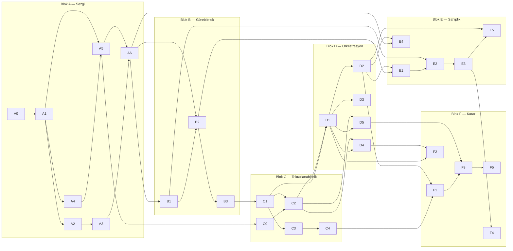

# 🗺️ Müfredat — Bloklar, Bağımlılık, Geçiş Sinyalleri

> *"Sıralama teknolojiye göre değil, bağımlılığa göre kurulur. Her adımın gerekçesi: bir sonrakini anlamak için bu şart."*

Bu sayfa patikanın iskeletidir: hangi modül hangi bloktadır, neyi ön koşul sayar,
bir bloktan diğerine ne zaman geçilir. **Blok sınırları ve bloklar arası sıra
değiştirilemez.** Blok *içinde* modül bölmek serbesttir.

Seviye ekseni araç sayısı değil, **sorumluluk yarıçapıdır:**

| | Tanım |
|---|---|
| **L0** | Tanımlı sistemde tanımlı işi yapar |
| **L1** | Bir sistemin sahibidir, o sistem için çağrı alır |
| **L2** | Hangi sistemin var olması gerektiğine karar verir, "hayır" diyebilir |

---

## 📋 Modül tablosu

| ID | Modül | Blok | Süre | Ön koşul |
|---|---|---|---|---|
| A0 | Başlamadan önce: ortam, terminal, patika nasıl işler | A · L0 | ~6s | — |
| A1 | Linux temeli: process, filesystem, izin, kullanıcı/grup | A · L0 | ~16s | A0 |
| A2 | Ağ I: TCP/IP, port, routing | A · L0 | ~14s | A1 |
| A3 | Ağ II: DNS → HTTP → TLS/sertifika | A · L0 | ~16s | A2 |
| A4 | Git temeli: commit, branch, merge, rebase, conflict | A · L0 | ~12s | A1 |
| A5 | Bash — iş görecek kadar kabuk | A · L0 | ~12s | A1, A4 |
| A6 | Bir uygulamayı **elle** ayağa kaldır (container YOK) | A · L0 | ~27s | A1, A2, A3, A4, A5 |
| B1 | Log okuma: journalctl, structured logging | B · L0 | ~12s | A6 |
| B2 | Metrik: Prometheus temeli, cardinality | B · L0 | ~12s | A6, B1 |
| B3 | **İlk kırık lab** — kırık VM'de arıza bulma | B · L0 | ~12s | B1, B2 |
| C0 | Ops için Python — otomasyon betiği yazacak kadar | C · L1 | ~30s | A5 |
| C1 | Container: image, katman, multi-stage, compose | C · L1 | ~14s | A6, B3 |
| C2 | CI: test → build → artifact → registry | C · L1 | ~16s | A4, C0, C1 |
| C3 | Terraform — A6'yı otomatikleştir | C · L1 | ~16s | A6, C1 |
| C4 | Bulut temelleri + **bütçe alarmı** | C · L1 | ~12s | C3 |
| D1 | K8s temel: Pod/Deployment/Service/Ingress — **RBAC + NetworkPolicy ilk günden** | D · L1 | ~28s | C1, C2 |
| D2 | K8s production: request/limit, probe, PDB, HPA | D · L1 | ~16s | D1 |
| D3 | Secret yönetimi | D · L1 | ~12s | D1 |
| D4 | Supply chain: tarama + imzalama — **C2 pipeline'ının devamı** | D · L1 | ~14s | C2, D1 |
| D5 | GitOps (ArgoCD) — tek uygulama | D · L1 | ~14s | D1, C2 |
| E1 | SLI / SLO / error budget | E · L1 | ~12s | B2, D2 |
| E2 | Alerting + on-call disiplini | E · L1 | ~12s | E1, B1 |
| E3 | Incident response + blameless postmortem | E · L1 | ~14s | E2 |
| E4 | Veritabanı production — özellikle **restore** | E · L1 | ~14s | A6, D2 |
| E5 | İleri kırık lab / chaos | E · L1 | ~12s | E3, D2 |
| F1 | Maliyet ve trade-off (FinOps) | F · L2 | ~10s | C4, D2 |
| F2 | Tehdit modelleme + uyum (KVKK / GDPR / SOC 2) | F · L2 | ~12s | D1, D4 |
| F3 | Platform, IDP, Team Topologies | F · L2 | ~10s | D5, F1 |
| F4 | Yazma: ADR, RFC, postmortem | F · L2 | ~10s | E3 |
| F5 | Stakeholder yönetimi, "hayır" demek, vendor | F · L2 | ~6s | F3 |

**Toplam:** 30 modül · ~423 saat · + 3 capstone (~60 saat) = **~483 saat**.
Blok toplamları: A 103 · B 36 · C 88 · D 84 · E 64 · F 48 · Capstone 60.

Kapı projeleri: **Capstone 1** (Blok C sonu), **Capstone 2** (Blok D sonu),
**Capstone 3** (Blok E sonu) → [`capstones/`](capstones/).

---

## 🔗 Bağımlılık grafiği (DAG — döngü yok)

**Doğrulama:** Her modülün her ön koşulu kendisinden **önce** gelir; döngü yoktur;
hiçbir modül sonraki bloğu ön koşul saymaz; A0 hiçbir şeyi ön koşul saymaz (tek
giriş noktası — sıfırdan başlayan buradan girer).

---

## 🚦 Geçiş sinyalleri — takvim değil

Blok geçişi süreyle değil, şu sorularla bağlanır. Kabul kriterlerin bu sinyalleri
somutlaştırır:

| Geçiş | Sinyal |
|---|---|
| A → B | Bir servisin neden ayağa kalkmadığını, dokümana bakmadan üç komutla daraltabiliyor musun? |
| B → C | Bir arızayı log ve metrikle **kanıtladın** mı, tahmin etmedin mi? |
| C → D | Sistemini sıfırdan, elle hiçbir şeye dokunmadan yeniden kurabiliyor musun? |
| D → E | Kendi kurduğun bir şey senin hatanla bozuldu ve sen geri getirdin mi? |
| E → F | Bir şeye "hayır" dedin ve gerekçeni yazılı savundun mu? |

Bu sinyaller her blok sonunda bir **sınavla** somutlaşır — her soru bir modülün
kabul kriterine izlenebilir, öznel "anladım" yoktur:

| Blok | Sınav | Kapı |
|---|---|---|
| A | [`block-a-intuition/STAGE-EXAM.md`](block-a-intuition/STAGE-EXAM.md) | A → B |
| B | [`block-b-visibility/STAGE-EXAM.md`](block-b-visibility/STAGE-EXAM.md) | B → C |
| C | [`block-c-reproducibility/STAGE-EXAM.md`](block-c-reproducibility/STAGE-EXAM.md) | C → D (+ [`Capstone 1`](capstones/CAP1-blok-c-sonu.md)) |
| D | [`block-d-orchestration/STAGE-EXAM.md`](block-d-orchestration/STAGE-EXAM.md) | D → E (+ [`Capstone 2`](capstones/CAP2-blok-d-sonu.md)) |
| E | [`block-e-ownership/STAGE-EXAM.md`](block-e-ownership/STAGE-EXAM.md) | E → F (+ [`Capstone 3`](capstones/CAP3-blok-e-sonu.md)) |

> Blok F bir sınavla kapanmaz — çıktısı yazıdır (ADR/RFC/postmortem) ve son iki
> kapı kendi kendine geçilemez (aşağıda **Dürüst tavan**).

---

## 🔒 En katı kural: Blok B bitmeden Blok C'ye geçilmez

Göremediğin sistemi yönetemezsin. Karmaşıklık (container, K8s) eklemeye başlamadan
önce, kurduğun sistemi **görebiliyor** olman gerekir. B3'ün kırık lab'ını
geçmeden C0/C1'e başlama.

## 🧵 Güvenlik iplik olarak içeride

Bu bir DevSecOps handbook'udur. "Önce K8s öğret, sonra ayrı bir hardening bölümü
koy" yapısı, reponun kendi eleştirdiği "güvenliği sona bırakma" hatasının
tekrarıdır. Bu yüzden D1 RBAC ve NetworkPolicy'siz yazılmaz; D4 ayrı bir güvenlik
dersi değil, C2'de kurulan pipeline'ın devamıdır. Güvenlik bir blok değil,
bloklara dağılmış bir ipliktir.

---

## 🧗 Dürüst tavan

> Son iki kapı (E, F) kendi kendine geçilemez. Seçmediğin bir arıza, sahibi olduğun
> bir sistem ve gerçek kullanıcı gerekir. Bu noktada yapılacak şey daha çok okumak
> değil: işe girmek, on-call rotasyonuna girmek, incident'e gönüllü olmak. Bu patika
> seni oraya kadar getirir; sonrasını üretim ortamı öğretir.

Neyin **henüz** eklenmediği ve niçin: [`NOT-YET.md`](NOT-YET.md).
Sertifika kapıları (Blok C/D/E sonu, 3 kapı — 10 değil): Faz 6.5'te `certifications/`.

---

> *"Aynı sisteme üç kez dönülür: D'de nasıl çalıştığı için, E'de nasıl bozulduğu için, F'de ne kadara mal olduğu ve kimin sahiplendiği için."*
