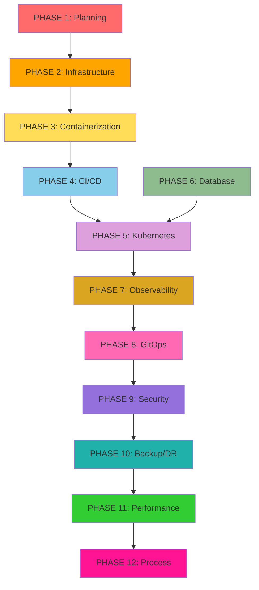

# 🗺️ **DevOps GitOps Kapsamlı Uygulama Yol Haritası** (Sıfırdan Production'a)

---

## 📋 **GENEL PRENSİPLER**
- **Security First**: Her adımda güvenlik öncelikli
- **Infrastructure as Code**: Her şey kod olarak yönetilir
- **Automation First**: Manuel işlemler minimize edilir
- **Observability**: Her katmanda gözlemlenebilirlik
- **Cost Optimization**: Kaynak kulımı sürekli optimize edilir

---

## 🟥 **PHASE 1: PLANLAMA & TEMELLERİN ATILMASI** (Hafta 1-2)

### A1. İŞ ANALİZİ & ENVANTER
| Adım | Konu | Araç | Açıklama | Öncelik |
|------|------|------|----------|---------|
| A1.1 | Mevcut sistem analizi | - | Tüm servisler, bağımlılıklar, DB'ler, API'ler | 🔴 Kritik |
| A1.2 | Trafik analizi | - | Peak saatler, kullanıcı sayısı, veri hacmi | 🔴 Kritik |
| A1.3 | Compliance gereksinimleri | - | GDPR, SOC2, ISO27001 vb. gereksinimler | 🟡 Yüksek |
| A1.4 | Budget & cost planning | AWS Cost Calculator | 12 aylık maliyet projeksiyonu | 🔴 Kritik |

### A2. GİT & VERSION CONTROL STRATEJİSİ
| Adım | Konu | Araç | Açıklama | Öncelik |
|------|------|------|----------|---------|
| A2.1 | Git flow stratejisi | GitHub/GitLab | GitFlow vs GitHub Flow vs GitLab Flow seçimi | 🔴 Kritik |
| A2.2 | Branch protection rules | GitHub | `main`, `develop` branch'leri korunur | 🔴 Kritik |
| A2.3 | Conventional commits | - | Commit message standardı: `feat:`, `fix:` | 🟡 Yüksek |
| A2.4 | Semantic versioning | - | v1.2.3 formatında versiyon yönetimi | 🟡 Yüksek |

### A3. GÜVENLİK TEMELLERİ
| Adım | Konu | Araç | Açıklama | Öncelik |
|------|------|------|----------|---------|
| A3.1 | AWS IAM stratejisi | AWS IAM | Least privilege principle | 🔴 Kritik |
| A3.2 | SSH key management | AWS Systems Manager | Centralized SSH key yönetimi | 🔴 Kritik |
| A3.3 | Secrets management stratejisi | HashiCorp Vault | Şifre, API key, cert yönetimi | 🔴 Kritik |

---

## 🟧 **PHASE 2: ALTYAPI OTOMASYONU** (Hafta 2-3)

### B1. TERRAFORM SETUP & BEST PRACTICES
| Adım | Konu | Araç | Açıklama | Öncelik |
|------|------|------|----------|---------|
| B1.1 | Terraform workspace setup | Terraform | Multi-environment support | 🔴 Kritik |
| B1.2 | Module structure | Terraform | Reusable modules: `vpc`, `eks`, `rds` | 🔴 Kritik |
| B1.3 | Remote state backend | S3 + DynamoDB | State locking ve versioning | 🔴 Kritik |
| B1.4 | Terraform plan automation | GitHub Actions | PR'larda otomatik plan çalıştır | 🟡 Yüksek |

### B2. NETWORK & SECURITY ALTYAPISI
| Adım | Konu | Araç | Açıklama | Öncelik |
|------|------|------|----------|---------|
| B2.1 | VPC tasarımı | Terraform + AWS VPC | Multi-AZ, public/private subnet'ler | 🔴 Kritik |
| B2.2 | Security Groups | Terraform | Least privilege network access | 🔴 Kritik |
| B2.3 | NAT Gateway | Terraform | Private subnet internet erişimi | 🔴 Kritik |
| B2.4 | VPC Flow Logs | Terraform + CloudWatch | Network traffic monitoring | 🟡 Yüksek |
| B2.5 | AWS WAF setup | Terraform + AWS WAF | Web application firewall | 🟡 Yüksek |

### B3. DNS & LOAD BALANCING
| Adım | Konu | Araç | Açıklama | Öncelik |
|------|------|------|----------|---------|
| B3.1 | Route53 setup | Terraform + Route53 | Domain ve DNS yönetimi | 🔴 Kritik |
| B3.2 | SSL/TLS certificate | Terraform + ACM | Wildcard certificate | 🔴 Kritik |
| B3.3 | Application Load Balancer | Terraform + ALB | HTTP/HTTPS load balancing | 🔴 Kritik |
| B3.4 | Network Load Balancer | Terraform + NLB | TCP load balancing (DB, cache) | 🟡 Yüksek |

---

## 🟨 **PHASE 3: CONTAINERIZATION & REGISTRY** (Hafta 3-4)

### C1. DOCKER OPTIMIZATION
| Adım | Konu | Araç | Açıklama | Öncelik |
|------|------|------|----------|---------|
| C1.1 | Multi-stage Dockerfile | Docker | Optimized image boyutu | 🔴 Kritik |
| C1.2 | Dockerfile linting | Hadolint | Best practice kontrolü | 🟡 Yüksek |
| C1.3 | Base image standardization | Docker | Distroless, Alpine tercih et | 🟡 Yüksek |
| C1.4 | .dockerignore optimization | Docker | Build context optimization | 🟡 Yüksek |

### C2. CONTAINER REGISTRY & SECURITY
| Adım | Konu | Araç | Açıklama | Öncelik |
|------|------|------|----------|---------|
| C2.1 | Container registry setup | GHCR/ECR | Private registry kurulumu | 🔴 Kritik |
| C2.2 | Image vulnerability scanning | Trivy/Snyk | Security scan pipeline | 🔴 Kritik |
| C2.3 | Image signing | Cosign | Container image imzalama | 🟡 Yüksek |
| C2.4 | Admission controllers | OPA Gatekeeper | Sadece güvenli image'ler deploy olur | 🟡 Yüksek |

---

## 🟦 **PHASE 4: CI/CD PIPELINE** (Hafta 4-5)

### D1. JENKINS SETUP & HARDENING
| Adım | Konu | Araç | Açıklama | Öncelik |
|------|------|------|----------|---------|
| D1.1 | Jenkins on Kubernetes | Helm + Jenkins Operator | Scalable Jenkins setup | 🔴 Kritik |
| D1.2 | Jenkins security hardening | Jenkins Security | RBAC, agent security | 🔴 Kritik |
| D1.3 | Pipeline as Code | Jenkinsfile | Shared libraries kullanımı | 🔴 Kritik |
| D1.4 | Jenkins backup strategy | Velero/Custom | Configuration ve job backup | 🟡 Yüksek |

### D2. ADVANCED CI/CD PATTERNS
| Adım | Konu | Araç | Açıklama | Öncelik |
|------|------|------|----------|---------|
| D2.1 | Parallel pipeline execution | Jenkins | Faster build times | 🟡 Yüksek |
| D2.2 | Build cache optimization | Docker BuildKit | Layer caching strategy | 🟡 Yüksek |
| D2.3 | Automated testing integration | Jest/PyTest | Unit, integration, e2e tests | 🔴 Kritik |
| D2.4 | SAST/DAST integration | SonarQube/OWASP ZAP | Static/Dynamic analysis | 🟡 Yüksek |

---

## 🟪 **PHASE 5: KUBERNETES PLATFORM** (Hafta 5-7)

### E1. EKS CLUSTER SETUP
| Adım | Konu | Araç | Açıklama | Öncelik |
|------|------|------|----------|---------|
| E1.1 | EKS cluster provisioning | Terraform + EKS | Multi-AZ, managed node groups | 🔴 Kritik |
| E1.2 | RBAC configuration | Kubernetes | AWS IAM integration | 🔴 Kritik |
| E1.3 | Network policies | Calico/Cilium | Pod-to-pod communication rules | 🟡 Yüksek |
| E1.4 | Pod Security Standards | Kubernetes | PSS enforcement | 🔴 Kritik |

### E2. STORAGE & PERSISTENCE
| Adım | Konu | Araç | Açıklama | Öncelik |
|------|------|------|----------|---------|
| E2.1 | StorageClass configuration | EBS CSI Driver | GP3, IO optimized storage | 🔴 Kritik |
| E2.2 | Persistent Volume management | Kubernetes | StatefulSet storage | 🔴 Kritik |
| E2.3 | Volume snapshot strategy | EBS Snapshots | Automated backup | 🟡 Yüksek |

### E3. INGRESS & SERVICE MESH
| Adım | Konu | Araç | Açıklama | Öncelik |
|------|------|------|----------|---------|
| E3.1 | Ingress controller | NGINX/ALB Ingress | TLS termination, path routing | 🔴 Kritik |
| E3.2 | Service mesh (opsiyonel) | Istio/Linkerd | mTLS, traffic management | 🟢 Orta |
| E3.3 | API Gateway | Kong/Ambassador | Rate limiting, auth | 🟡 Yüksek |

### E4. AUTO SCALING
| Adım | Konu | Araç | Açıklama | Öncelik |
|------|------|------|----------|---------|
| E4.1 | Horizontal Pod Autoscaler | HPA | CPU/Memory based scaling | 🔴 Kritik |
| E4.2 | Vertical Pod Autoscaler | VPA | Resource recommendation | 🟡 Yüksek |
| E4.3 | Cluster Autoscaler | EKS Cluster Autoscaler | Node auto scaling | 🔴 Kritik |
| E4.4 | KEDA setup | KEDA | Event-driven autoscaling | 🟢 Orta |

---

## 🟫 **PHASE 6: DATA & DATABASE LAYER** (Hafta 6-7)

### F1. DATABASE SETUP
| Adım | Konu | Araç | Açıklama | Öncelik |
|------|------|------|----------|---------|
| F1.1 | RDS setup | Terraform + RDS | Multi-AZ, encrypted | 🔴 Kritik |
| F1.2 | Database migration strategy | Flyway/Liquibase | Schema versioning | 🔴 Kritik |
| F1.3 | Connection pooling | PgBouncer/RDS Proxy | Connection optimization | 🟡 Yüksek |
| F1.4 | Read replicas | RDS | Read traffic optimization | 🟡 Yüksek |

### F2. CACHING LAYER
| Adım | Konu | Araç | Açıklama | Öncelik |
|------|------|------|----------|---------|
| F2.1 | Redis/ElastiCache setup | Terraform + ElastiCache | Session store, caching | 🟡 Yüksek |
| F2.2 | Cache strategy implementation | Application level | TTL, invalidation patterns | 🟡 Yüksek |

---

## 🟩 **PHASE 7: OBSERVABILITY STACK** (Hafta 7-8)

### G1. METRICS & MONITORING
| Adım | Konu | Araç | Açıklama | Öncelik |
|------|------|------|----------|---------|
| G1.1 | Prometheus setup | Helm + kube-prometheus-stack | Metrics collection | 🔴 Kritik |
| G1.2 | Grafana dashboards | Grafana | Pre-built dashboard import | 🔴 Kritik |
| G1.3 | Custom metrics | Prometheus Client | Application metrics | 🟡 Yüksek |
| G1.4 | SLI/SLO definition | Prometheus + Grafana | Service Level Objectives | 🟡 Yüksek |

### G2. LOGGING STACK
| Adım | Konu | Araç | Açıklama | Öncelik |
|------|------|------|----------|---------|
| G2.1 | Log aggregation | Fluent Bit + OpenSearch | Centralized logging | 🔴 Kritik |
| G2.2 | Log parsing & enrichment | Logstash/Vector | Structured logging | 🟡 Yüksek |
| G2.3 | Log retention policy | OpenSearch | Cost-optimized retention | 🟡 Yüksek |
| G2.4 | Log-based alerting | OpenSearch + Grafana | Error pattern detection | 🟡 Yüksek |

### G3. DISTRIBUTED TRACING
| Adım | Konu | Araç | Açıklama | Öncelik |
|------|------|------|----------|---------|
| G3.1 | Tracing setup | Jaeger/Zipkin | Request tracing | 🟢 Orta |
| G3.2 | Application instrumentation | OpenTelemetry | Auto-instrumentation | 🟢 Orta |

### G4. ALERTING & INCIDENT RESPONSE
| Adım | Konu | Araç | Açıklama | Öncelik |
|------|------|------|----------|---------|
| G4.1 | Alertmanager setup | Alertmanager | Alert routing & grouping | 🔴 Kritik |
| G4.2 | PagerDuty/Slack integration | PagerDuty API | Incident escalation | 🟡 Yüksek |
| G4.3 | Runbook automation | Ansible/Runbook | Automated remediation | 🟢 Orta |

---

## 🟪 **PHASE 8: ADVANCED DEPLOYMENT** (Hafta 8-9)

### H1. GITOPS IMPLEMENTATION
| Adım | Konu | Araç | Açıklama | Öncelik |
|------|------|------|----------|---------|
| H1.1 | ArgoCD setup | ArgoCD/Flux | GitOps continuous deployment | 🔴 Kritik |
| H1.2 | Application of Applications | ArgoCD | Multi-app management | 🟡 Yüksek |
| H1.3 | Environment promotion | ArgoCD + Git | Automated environment sync | 🟡 Yüksek |
| H1.4 | Config drift detection | ArgoCD | Drift remediation | 🟡 Yüksek |

### H2. PROGRESSIVE DEPLOYMENT
| Adım | Konu | Araç | Açıklama | Öncelik |
|------|------|------|----------|---------|
| H2.1 | Blue-Green deployment | ArgoCD Rollouts | Zero-downtime deployment | 🟡 Yüksek |
| H2.2 | Canary deployment | ArgoCD Rollouts | Progressive traffic shifting | 🟡 Yüksek |
| H2.3 | Feature flags | LaunchDarkly/Unleash | Feature toggle management | 🟢 Orta |
| H2.4 | Automated rollback | ArgoCD + Prometheus | Metric-based rollback | 🟡 Yüksek |

---

## 🟨 **PHASE 9: SECURITY & COMPLIANCE** (Hafta 9-10)

### I1. RUNTIME SECURITY
| Adım | Konu | Araç | Açıklama | Öncelik |
|------|------|------|----------|---------|
| I1.1 | Falco deployment | Falco | Runtime threat detection | 🟡 Yüksek |
| I1.2 | Network policies | Calico/Cilium | Micro-segmentation | 🟡 Yüksek |
| I1.3 | Pod Security Standards | Kubernetes | Pod security enforcement | 🔴 Kritik |
| I1.4 | Image scanning | Twistlock/Aqua | Runtime vulnerability scan | 🟡 Yüksek |

### I2. POLICY AS CODE
| Adım | Konu | Araç | Açıklama | Öncelik |
|------|------|------|----------|---------|
| I2.1 | OPA Gatekeeper | OPA Gatekeeper | Admission control policies | 🟡 Yüksek |
| I2.2 | Falco rules | Falco | Security event rules | 🟡 Yüksek |
| I2.3 | Compliance scanning | Kube-bench/Kube-hunter | CIS benchmark compliance | 🟡 Yüksek |

### I3. SECRETS MANAGEMENT
| Adım | Konu | Araç | Açıklama | Öncelik |
|------|------|------|----------|---------|
| I3.1 | HashiCorp Vault | Vault | Centralized secrets | 🔴 Kritik |
| I3.2 | External Secrets Operator | ESO | Vault-K8s integration | 🟡 Yüksek |
| I3.3 | Secret rotation | Vault + ESO | Automated secret rotation | 🟡 Yüksek |

---

## 🟦 **PHASE 10: BACKUP & DISASTER RECOVERY** (Hafta 10-11)

### J1. BACKUP STRATEGY
| Adım | Konu | Araç | Açıklama | Öncelik |
|------|------|------|----------|---------|
| J1.1 | Velero setup | Velero | Kubernetes backup | 🔴 Kritik |
| J1.2 | RDS automated backup | AWS RDS | Point-in-time recovery | 🔴 Kritik |
| J1.3 | EBS snapshot automation | AWS Backup | Volume snapshots | 🟡 Yüksek |
| J1.4 | Cross-region backup | AWS Backup | Disaster recovery | 🟡 Yüksek |

### J2. DISASTER RECOVERY
| Adım | Konu | Araç | Açıklama | Öncelik |
|------|------|------|----------|---------|
| J2.1 | DR runbook | Documentation | Step-by-step recovery | 🔴 Kritik |
| J2.2 | DR testing | Scheduled tests | Quarterly DR drills | 🟡 Yüksek |
| J2.3 | RTO/RPO definition | - | Recovery objectives | 🔴 Kritik |

---

## 🟩 **PHASE 11: PERFORMANCE & OPTIMIZATION** (Hafta 11-12)

### K1. PERFORMANCE TESTING
| Adım | Konu | Araç | Açıklama | Öncelik |
|------|------|------|----------|---------|
| K1.1 | Load testing setup | K6/Artillery | Automated load tests | 🟡 Yüksek |
| K1.2 | Chaos engineering | Chaos Monkey/Litmus | Failure testing | 🟢 Orta |
| K1.3 | Database optimization | pganalyze/PMM | Query optimization | 🟡 Yüksek |

### K2. COST OPTIMIZATION
| Adım | Konu | Araç | Açıklama | Öncelik |
|------|------|------|----------|---------|
| K2.1 | Resource rightsizing | VPA/Goldilocks | Optimal resource allocation | 🟡 Yüksek |
| K2.2 | Spot instance usage | Karpenter | Cost-effective compute | 🟡 Yüksek |
| K2.3 | Cost monitoring | AWS Cost Explorer | FinOps practices | 🟡 Yüksek |

---

## 🟪 **PHASE 12: TEAM & PROCESS** (Sürekli)

### L1. DOCUMENTATION & KNOWLEDGE SHARING
| Adım | Konu | Araç | Açıklama | Öncelik |
|------|------|------|----------|---------|
| L1.1 | Architecture documentation | Confluence/Notion | System design docs | 🔴 Kritik |
| L1.2 | Runbook automation | Ansible + Documentation | Operational procedures | 🟡 Yüksek |
| L1.3 | Team training | - | Knowledge transfer sessions | 🟡 Yüksek |

### L2. CONTINUOUS IMPROVEMENT
| Adım | Konu | Araç | Açıklama | Öncelik |
|------|------|------|----------|---------|
| L2.1 | Post-mortem process | - | Incident analysis | 🟡 Yüksek |
| L2.2 | Metrics-driven improvements | Grafana + Analytics | Data-driven decisions | 🟡 Yüksek |
| L2.3 | Technology radar | - | Emerging tech evaluation | 🟢 Orta |

---

## 🎯 **KRİTİK BAŞARI FAKTÖRLERİ**

### ✅ **Hafta 1-3: Temel Altyapı**
- [ ] AWS hesap organizasyonu ve IAM yapısı
- [ ] VPC ve network güvenliği
- [ ] Terraform state management
- [ ] CI/CD pipeline MVP

### ✅ **Hafta 4-6: Platform Katmanı**
- [ ] Kubernetes cluster production-ready
- [ ] Container registry ve security scanning
- [ ] Basic monitoring ve alerting
- [ ] Database setup ve backup

### ✅ **Hafta 7-9: İleri Seviye**
- [ ] Comprehensive observability
- [ ] GitOps implementation
- [ ] Progressive deployment
- [ ] Security hardening

### ✅ **Hafta 10-12: Operasyonel Mükemmellik**
- [ ] Disaster recovery tested
- [ ] Performance optimization
- [ ] Cost optimization
- [ ] Team documentation complete

---

## 🚨 **AŞAMALAR ARASI BAĞIMLILIKLAR**

---

## 💡 **ÖNERİLER & BEST PRACTICES**

### 🔥 **Kritik Öneriler**
1. **Security First**: Her bileşende güvenlik kontrolü
2. **Infrastructure as Code**: %100 kod ile yönetim
3. **Monitoring Everything**: Her katmanda metrik toplama
4. **Automated Testing**: CI/CD pipeline'da comprehensive test
5. **Documentation**: Her adımı dokümante et
6. **Cost Awareness**: Her kaynağı maliyet perspektifinde değerlendir

### 🎯 **Hızlı Başlangıç İçin**
1. **Minimum Viable Platform (MVP)** yaklaşımı benimse
2. **Buy vs Build** kararları için şirket ihtiyacını öncelik al
3. **Cloud-Native** çözümleri on-premise alternatiflere tercih et
4. **Managed Services** kullanarak operasyonel yükü azalt
5. **Community Standards** ile uyumlu araçları seç

---

## 🎉 **SONUÇ**

Bu roadmap 12 haftalık bir süreçte modern, ölçeklenebilir ve güvenli bir DevOps altyapısı kurmanızı sağlayacaktır. Her fase kendi içinde test edilebilir ve değerlendirebilir durumda tasarlanmıştır.
